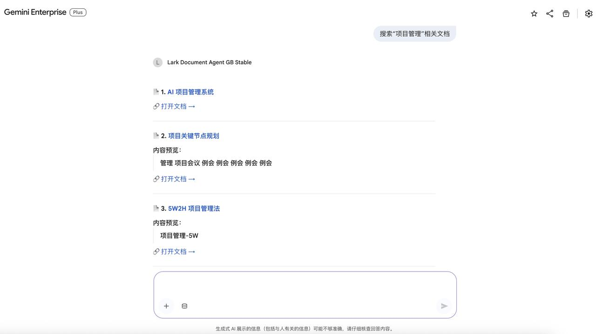
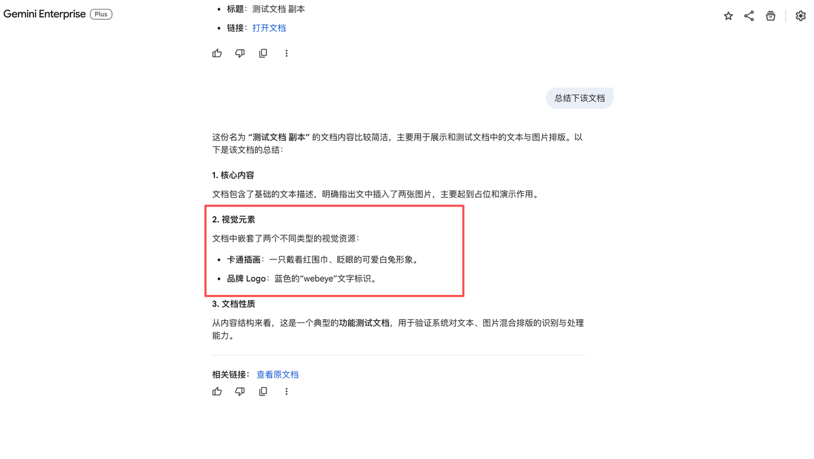
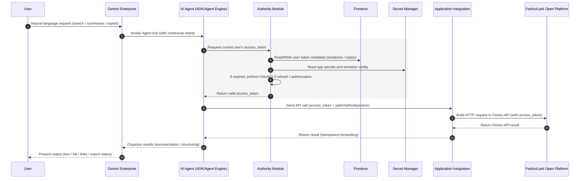
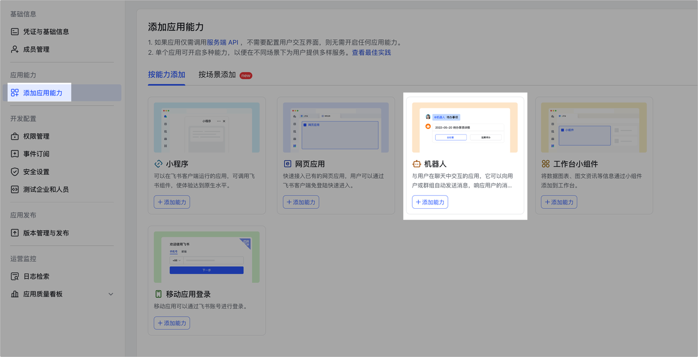
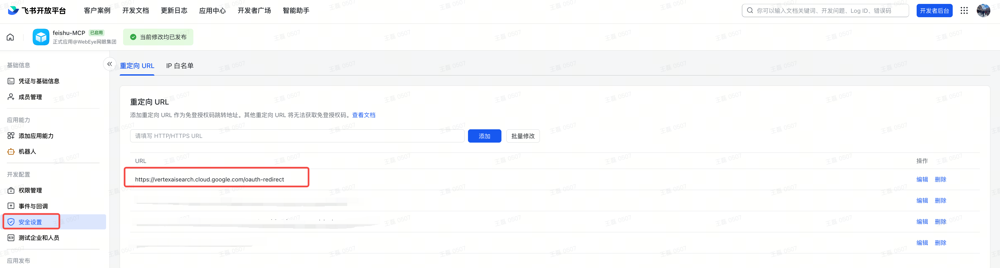

# Lark Agent (ADK Agent)

这是一个基于 Google Agent Development Kit (ADK) 构建的智能对话助手，旨在帮助企业员工在统一的 AI 交互环境中，通过自然语言对话快速、安全地查询和获取 Lark (飞书) 云文档的内容。

## ✨ 主要功能

*   **文档智能搜索**: 支持通过自然语言关键词搜索 Lark 云文档，并以 Markdown 超链接形式直观展示结果。
*   **文档内容问答**: Agent 可以深入读取文档的具体内容（支持 Markdown 格式），并基于内容回答用户的问题。
*   **安全认证**: 集成了 Lark OAuth2.0 认证流程。当检测到用户未授权时，会自动引导用户进行安全登录（Gemini Enterprise默认行为）。

## 🎥 使用演示





## 🏗️ 架构设计

本项目遵循 Clean Architecture 原则，主要包含以下模块：

*   **lark_agent/**: Agent 的核心逻辑。
    *   `agent.py`: 定义 `LlmAgent` 的角色、Prompt 和工具集。
    *   `tools.py`: 定义供 Agent 调用的工具函数（Interface Adapter 层）。
    *   `infrastructure/`: 基础设施层，包含 `lark_api_repository.py` (Lark API 调用)。

系统时序图如下所示：



## ⚙️ 配置 (.env)

在本地运行或部署前，请在项目根目录创建 `.env` 文件，并修改必填配置：

```env
# --- 飞书 (Lark) 集成配置 ---
# （必填参数）注册 Agent Engine 到 Gemini Enterprise 时设置的 auth_id (唯一资源标识符，自定义)
LARK_AUTH_ID="your-unique-auth-id"  # 如 lark-agent-oauth-id
# （必填参数）飞书开放平台应用 App ID
LARK_CLIENT_ID="your-lark-app-id"
# （必填参数）飞书开放平台应用 App Secret
LARK_CLIENT_SECRET="your-lark-app-secret"


# --- Google Cloud Platform (Vertex AI) 配置 ---
# （必填参数）GCP 项目 ID (Vertex AI 调用及部署时需要)
PROJECT_ID=""  # your-project-id


# --- Gemini Enterprise 配置，查看App: https://console.cloud.google.com/gemini-enterprise/apps ---
# （必填参数）Gemini Enterprise 中对应的 App (Engine) ID
GE_APP_ID=""  # 如 webeye-app_1742521319182
# （必填参数）Gemini Enterprise 数据区域 (如 global, us, eu)
GE_APP_LOCATION="global"  # e.g., global, us, eu


# --- 本地运行配置 ---
# （选填）是否使用 Vertex AI (1) 或 Google AI Studio (0)
GOOGLE_GENAI_USE_VERTEXAI=0
# （选填）Google API Key (仅在 GOOGLE_GENAI_USE_VERTEXAI=0 时需要)
GOOGLE_API_KEY="your-api-key"
```

## 🚀 部署与运行

> **📖 详细部署指南**：请参考 [docs/DEPLOYMENT_GUIDE.md](docs/DEPLOYMENT_GUIDE.md) 了解完整的打包部署流程、注意事项和常见问题解决方案。

### 前置要求

*   Python 3.12+
*   Google Cloud Project (启用 Vertex AI, Cloud Run, Firestore API)
*   飞书/Lark 开放平台应用app应用 (获取 App ID 和 Secret，配置 OAuth 回调 URL)

### 飞书/Lark App创建

1. 请访问 开发者后台 创建一个新应用，并获得：
    * `App ID` - 飞书/Lark应用编号
    * `App Secret` - 请注意保管 App Secret，不要泄露到互联网。

2. 在应用管理页面，点击添加应用能力，找到机器人卡片，点击 +添加。
    

3. 为应用开启如下权限
    ```json
    {
      "scopes": {
        "tenant": [
          "bitable:app",
          "docs:document:import",
          "docx:document",
          "drive:drive",
          "drive:drive.metadata:readonly",
          "drive:drive.search:readonly",
          "drive:drive:readonly",
          "wiki:wiki",
          "wiki:wiki:readonly"
        ],
        "user": [
          "docs:document.content:read",
          "docs:document.media:download",
          "docs:document:export",
          "docx:document.media:download",
          "docs:permission.setting:read",
          "docx:document",
          "docx:document:readonly",
          "drive:export:readonly",
          "offline_access",
          "search:docs:read"
        ] 
      }
    }
    ```
4. 配置 OAuth2.0 回调 URL：
    ```
    https://vertexaisearch.cloud.google.com/oauth-redirect
    ```
   

5. 发布应用到企业。

### 🚀 快速部署 (推荐)

如果您是第一次使用本项目，请按照以下步骤快速完成环境准备与部署：

**1. 初始化环境**:
```bash
# 自动执行：安装 uv, 准备 Python 环境, 创建 .env, 检查并准备 GCS Bucket
bash scripts/init.sh
```
*注意：脚本会自动从 `.env.example` 创建 `.env`。执行后请务必打开 `.env` 并根据注释填写必填参数。*

**2. 一键部署**:
```bash
# 自动执行：打包应用 -> 部署到 Vertex AI -> 自动注册/更新到 Gemini Enterprise
bash deploy.sh
```
*部署完成后，控制台会输出直接访问 Gemini Enterprise 和 Vertex AI 的快捷链接。*

---

### 💻 本地运行与开发

**1. 本地 CLI 运行**:

本地运行前请先获取飞书/Lark应用的用户访问令牌（access_token）。并替换`tools.py` 中 `access_token = tool_context.state[f"{LARK_AUTH_ID}"]` 的代码。

```bash
uv run python -m lark_agent.main
```

**2. ADK Web 界面运行**:

启动本地开发服务器，通过 Web UI 与 Agent 交互：

```bash
uv run adk web
```

---

### 🛠️ 进阶说明

如果您需要手动执行特定步骤，可以参考以下脚本：

*   **环境初始化**: [scripts/init.sh](scripts/init.sh)
*   **注册到 Gemini Enterprise**: [scripts/register_to_GE.sh](scripts/register_to_GE.sh)
*   **更新 Gemini Enterprise 引擎**: [scripts/update_agent_GE.sh](scripts/update_agent_GE.sh)

**详细部署细节与常见问题**：请参考 [docs/DEPLOYMENT_GUIDE.md](docs/DEPLOYMENT_GUIDE.md)。

## 🛠️ 开发与贡献

*   **依赖管理**: 本项目使用 `uv` 进行高效的包管理。
    ```bash
    uv sync
    ```
*   **代码风格**: 遵循 Python 标准代码风格。

## 📚 相关文档

*   [docs/DEPLOYMENT_GUIDE.md](docs/DEPLOYMENT_GUIDE.md) - 详细的打包部署指南
*   [scripts/README.md](scripts/README.md) - 脚本工具使用说明
*   [docs/GEMINI_ENTERPRISE_REGISTRATION_GUIDE.md](docs/GEMINI_ENTERPRISE_REGISTRATION_GUIDE.md) - Gemini Enterprise 注册指南