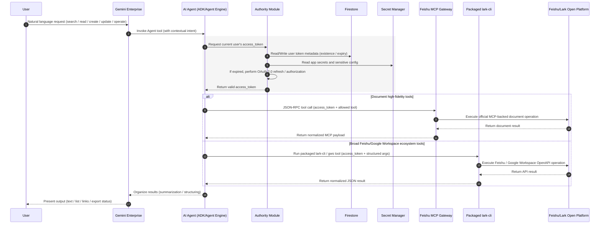

# WebEye Nexus Agent (webeye-ge-nexus-agent)

**WebEye Nexus Agent for Gemini Enterprise** 这是一个基于 Google Agent Development Kit (ADK) 构建的企业级智能 Agent。本项目部署于 Vertex AI Agent Engine 与 Gemini Enterprise 生产环境，并深度整合了飞书生态与 Google Workspace。旨在帮助企业员工在统一的 AI 交互环境中，通过自然语言对话快速、安全、高效地完成飞书云文档、云盘检索、以及 Google 日历与表格等跨平台操作。

## ✨ 主要功能

*   **文档智能搜索**: 支持通过自然语言关键词搜索飞书云文档，并以 Markdown 超链接形式展示结果。
*   **文档内容问答**: 支持读取飞书文档内容，包含 Markdown 文本与多模态图片内容，并基于文档内容回答问题。
*   **AI 输出写入文档**: 支持将 Agent 生成的 Markdown 内容写入新的飞书云文档，或追加、覆盖更新已有文档，并返回文档链接、任务状态或更新结果。
*   **飞书生态操作扩展**: 内置 `lark-cli` 二进制，可通过 CLI 封装或通用 OpenAPI 工具扩展 Drive、Wiki、Base、Sheets、Calendar、Task、IM 等飞书能力。
*   **Google Workspace 深度整合**: 内置 `gws` 二进制工具，支持通过 Gemini Enterprise OAuth2 注入的用户态凭证无缝调用 Google APIs（如 Google Calendar、Google Sheets 等），支持日程管理、表格读写与跨生态办公联动。
*   **双生态 OAuth 安全认证**: 完美继承 Gemini Enterprise 的安全授权机制，支持飞书与 Google Workspace 双重 OAuth 认证流程。当检测到用户未授权时，会自动引导用户登录授权，确保企业数据安全合规。
*   **高抗震防灾设计 (Anti-Crash)**: 引入了工业级全局防御与异常拦截机制（Phase VII），全方位隔离因临期凭证、第三方 API 抖动、并发或极端入参导致的异常，以卓越的弹性降级与入参类型守卫，杜绝模型运行时崩溃，实现全年无休高可用。

## 🎥 使用演示


## 🏗️ 架构设计

本项目遵循 Clean Architecture 原则，主要包含以下模块：

*   **nexus_agent/**: Agent 的核心逻辑。
    *   `agent.py`: 定义 `LlmAgent` 的角色、Prompt 和工具集。
    *   `tools.py`: 定义供 Agent 调用的工具函数，负责参数校验、授权读取、结果归一化和业务级封装。
    *   `callbacks.py`: 处理多模态响应兼容性等运行时补丁。
    *   `lark_registry/commands.json` & `gws_registry/commands.json`: 平台命令元数据注册表，驱动二进制的自省和模糊匹配。
    *   `infrastructure/lark_api_repository.py`: 封装飞书 OpenAPI、文档读取和飞书 MCP 网关调用。
    *   `infrastructure/cli_client.py`: 统一封装随包发布的 `lark-cli` 与 `gws` 二进制工具，使用隔离 `HOME` 和环境变量，在安全沙箱中惰性传递并应用用户态 OAuth 凭证。

系统时序图如下所示：


```mermaid
sequenceDiagram
  autonumber
  participant U as User
  participant G as Gemini Enterprise
  participant AE as AI Agent (ADK/Agent Engine)
  participant AUTH as Authority Module
  participant DB as Firestore
  participant SM as Secret Manager
  participant MCP as Feishu MCP Gateway
  participant CLI as Packaged lark-cli
  participant FS as Feishu/Lark Open Platform

  U->>G: Natural language request (search / read / create / update / operate)
  G->>AE: Invoke Agent tool (with contextual intent)

  rect rgb(245,245,245)
    AE->>AUTH: Request current user's access_token
    AUTH->>DB: Read/Write user token metadata (existence / expiry)
    AUTH->>SM: Read app secrets and sensitive config
    AUTH->>AUTH: If expired, perform OAuth 2.0 refresh / authorization
    AUTH-->>AE: Return valid access_token
  end

  alt Document high-fidelity tools
    AE->>MCP: JSON-RPC tool call (access_token + allowed tool)
    MCP->>FS: Execute official MCP-backed document operation
    FS-->>MCP: Return document result
    MCP-->>AE: Return normalized MCP payload
  else Broad Feishu/Google Workspace ecosystem tools
    AE->>CLI: Run packaged lark-cli / gws tool (access_token + structured args)
    CLI->>FS: Execute Feishu / Google Workspace OpenAPI operation
    FS-->>CLI: Return API result
    CLI-->>AE: Return normalized JSON result
  end

  AE-->>G: Organize results (summarization / structuring)
  G-->>U: Present output (text / list / links / export status)
```

### 🛡️ 极限防灾与安全加固 (Phase VII)

为了将本 Agent 打造为工业级高可用的企业级跨平台智能助手，我们在 **Phase VII** 中实施了全方位的安全防护与全局异常拦截机制（Anti-Crash Hardening）：

*   **凭证安全沙箱化与惰性获取**：将 `lark-cli` 及 `gws` 二进制调用器中获取用户 OAuth Token 的逻辑深埋于底层执行沙箱中，仅在命令执行前一刻进行加密和惰性拉取，且全程由 `try-except` 进行强力容错防护。彻底根治了临期 Token 过期或获取网络抖动导致的启动级/调用级崩溃。
*   **强类型安全守卫 (Guardians)**：在所有高频及高风险工具（如创建/列出日程等）的入口层引入物理级及强类型参数校准机制。对 `datetime`、`max_results` 等参数进行强制校验、转换与格式归一化。即使大模型在幻觉或极端语境下生成了不合规、越界的 JSON 入参，也会被防御层静默校准与修复，绝对不传导至底层，保障系统无懈可击。
*   **弹性降级拦截**：所有的底层 API 与 CLI 工具皆由双重 `try-except` 兜底。若飞书侧或 Google 日历服务器发生临时熔断，Agent 将通过规范化的 JSON-RPC 容错报文进行弹性降级答复，以友好、专业的回复代替系统异常栈抛出，守护模型完美的运行时生命周期。

## ⚙️ 配置 (.env)

在本地运行或部署前，请在项目根目录创建 `.env` 文件，并修改必填配置（参考如下示例）：

```env
# --- 飞书 (Lark) 集成配置 ---
# （必填参数）注册 Agent Engine 到 Gemini Enterprise 时设置的 auth_id (唯一资源标识符，自定义)
LARK_AUTH_ID="your-unique-auth-id"  # 如 lark-agent-oauth-id
# （必填参数）飞书开放平台应用 App ID
LARK_CLIENT_ID="your-lark-app-id"
# （必填参数）飞书开放平台应用 App Secret
LARK_CLIENT_SECRET="your-lark-app-secret"

# --- Google Workspace 集成配置 ---
# （选填）注册 Google Workspace OAuth 到 Gemini Enterprise 时设置的 auth_id；必须对每个 Agent 唯一
GOOGLE_WORKSPACE_AUTH_ID="your-google-workspace-auth-id"
# （启用 Google Workspace GE OAuth 时必填）Google Cloud OAuth Web Client 凭证
GOOGLE_WORKSPACE_CLIENT_ID="your-google-workspace-client-id"
GOOGLE_WORKSPACE_CLIENT_SECRET="your-google-workspace-client-secret"
# （选填）gws helper 需要 GCP project 时使用；默认可复用 PROJECT_ID
GOOGLE_WORKSPACE_PROJECT_ID=""

# --- Google Cloud Platform (Vertex AI) 配置 ---
# （必填参数）GCP 项目 ID (Vertex AI 调用及部署时需要)
PROJECT_ID="your-gcp-project-id"
# （选填）API 服务区域 (如 us-central1，全局为 global)
LOCATION="global"
# （选填）目标 Gemini 模型名称 (如 gemini-3-flash-preview)
MODEL_NAME="gemini-3-flash-preview"

# --- Google Cloud 部署配置 ---
# （选填）Reasoning Engine 的部署区域 (如 us-central1)
DEPLOY_LOCATION="us-central1"
# （选填）用于存放部署文件的 Google Cloud Storage Bucket 地址
STAGING_BUCKET="gs://adk-agent-deploy"
# （选填）Agent 显示名称
AGENT_DISPLAY_NAME="WebEye Nexus Agent"
# （选填）Agent 描述信息
AGENT_DESCRIPTION="Nexus Agent for Gemini Enterprise integrating Lark & Google Workspace"

# --- Gemini Enterprise 配置，查看App: https://console.cloud.google.com/gemini-enterprise/apps ---
# （必填参数）Gemini Enterprise 中对应的 App (Engine) ID
GE_APP_ID="your-ge-app-id"  # 如 webeye-app_1742521319182
# （必填参数）Gemini Enterprise 数据区域 (如 global, us, eu)
GE_APP_LOCATION="global"

# --- 本地运行配置 ---
# （选填）是否使用 Vertex AI (1) 或 Google AI Studio (0)
GOOGLE_GENAI_USE_VERTEXAI=0
# （选填）Google API Key (仅在 GOOGLE_GENAI_USE_VERTEXAI=0 时需要)
GOOGLE_API_KEY="your-api-key"
```

## 🚀 部署与运行

> **📖 详细部署指南**：请参考 [docs/DEPLOYMENT_GUIDE.md](docs/DEPLOYMENT_GUIDE.md) 了解完整的打包部署流程、注意事项和常见问题解决方案。

### 前置要求

*   Python 3.12+
*   Google Cloud Project (启用 Vertex AI, Cloud Run, Firestore API)
*   飞书/Lark 开放平台应用app应用 (获取 App ID 和 Secret，配置 OAuth 回调 URL)

### 飞书/Lark App创建

1. 请访问 开发者后台 创建一个新应用，并获得：
    * `App ID` - 飞书/Lark应用编号
    * `App Secret` - 请注意保管 App Secret，不要泄露到互联网。

2. 在应用管理页面，点击添加应用能力，找到机器人卡片，点击 +添加。
    

3. 为应用开启如下权限
    ```json
    {
      "scopes": {
        "tenant": [
          "bitable:app",
          "docs:document:import",
          "docx:document",
          "drive:drive",
          "drive:drive.metadata:readonly",
          "drive:drive.search:readonly",
          "drive:drive:readonly",
          "wiki:wiki",
          "wiki:wiki:readonly"
        ],
        "user": [
          "docs:document.content:read",
          "docs:document.media:download",
          "docs:document:export",
          "docx:document.media:download",
          "docs:permission.setting:read",
          "docx:document",
          "docx:document:readonly",
          "drive:export:readonly",
          "offline_access",
          "search:docs:read"
        ] 
      }
    }
    ```
4. 配置 OAuth2.0 回调 URL：
    ```
    https://vertexaisearch.cloud.google.com/oauth-redirect
    ```
   

5. 发布应用到企业。

### 🚀 快速部署 (推荐)

如果您是第一次使用本项目，请按照以下步骤快速完成环境准备与部署：

**1. 初始化环境**:
```bash
# 自动执行：安装 uv, 准备 Python 环境, 创建 .env, 检查并准备 GCS Bucket
bash scripts/init.sh
```
*注意：脚本会自动从 `.env.example` 创建 `.env`。执行后请务必打开 `.env` 并根据注释填写必填参数。*

**2. 一键部署**:
```bash
# 自动执行：打包应用 -> 部署到 Vertex AI -> 自动注册/更新到 Gemini Enterprise
bash deploy.sh
```
*部署完成后，控制台会输出直接访问 Gemini Enterprise 和 Vertex AI 的快捷链接。*

---

### 💻 本地运行与开发

**1. 本地 CLI 运行**:

本地运行会启动命令行交互。涉及飞书写操作或用户态读取时，工具会从运行上下文读取 Gemini Enterprise OAuth 注入的 access token；如需本地验证单个工具，建议直接编写测试或临时脚本传入 access token，不要修改 `tools.py` 中的授权读取逻辑。

```bash
uv run python -m nexus_agent.main
```

**2. ADK Web 界面运行**:

启动本地开发服务器，通过 Web UI 与 Agent 交互：

```bash
uv run adk web
```

### ✍️ 将 AI 输出写入飞书文档

当前已支持通过飞书官方 MCP 网关创建云文档，并将 Agent 生成的 Markdown 内容写入新文档或已有文档。创建、更新类操作可能返回异步 `task_id`，可继续让 Agent 查询任务状态。

推荐触发方式：

```text
请帮我生成一份项目周报，并直接写入飞书文档，标题叫“项目周报”
```

```text
请把这段总结追加到这个飞书文档：https://...
```

能力说明见：

- [docs/FEISHU_DOC_SAVE_MCP_GUIDE.md](docs/FEISHU_DOC_SAVE_MCP_GUIDE.md)

---

### 🛠️ 进阶说明

如果您需要手动执行特定步骤，可以参考以下脚本：

*   **环境初始化**: [scripts/init.sh](scripts/init.sh)
*   **注册到 Gemini Enterprise**: [scripts/register_to_GE.sh](scripts/register_to_GE.sh)
*   **更新 Gemini Enterprise 引擎**: [scripts/update_agent_GE.sh](scripts/update_agent_GE.sh)

**详细部署细节与常见问题**：请参考 [docs/DEPLOYMENT_GUIDE.md](docs/DEPLOYMENT_GUIDE.md)。

## 🛠️ 开发与贡献

*   **依赖管理**: 本项目使用 `uv` 进行高效的包管理。
    ```bash
    uv sync
    ```
*   **代码风格**: 遵循 Python 标准代码风格.
*   **自动化测试**: 拥有覆盖核心工具、API 仓储、多模态回调及防崩溃安全守卫的完整测试套件。目前全量 **75 项单元测试 100% 绿旗通过**，有力地保障了在进行底层加固与扩展时的零回归、零崩溃：
    ```bash
    .venv/bin/pytest -v
    ```

### 🔄 如何更新平台命令索引库文件 (commands.json)

作为面向多平台扩展的 Agent 引擎，其核心的自省与分词模糊匹配能力重度依赖随包发布的 `commands.json` 命令元数据字典。当飞书、Google Workspace 等平台有 API 扩展，或二进制文件升级引入新命令时，可遵循以下维护指引：

1. **一键生成/刷新最新索引**：
   在本地环境中，通过 `uv run` 触发项目内置的自动化抓取索引生成器，它会自动调用本地二进制，解析命令并融合、导出最新的 JSON 文件：
   ```bash
   # 更新 Lark (飞书) 平台命令索引注册表
   uv run scripts/build_lark_command_index.py
   
   # 更新 Google Workspace (GWS) 平台命令索引注册表
   uv run scripts/build_gws_command_index.py
   ```
2. **测试与提交验证**：
   运行本地测试，确认新命令在加载和匹配时均完美通过：
   ```bash
   .venv/bin/pytest -v
   ```
3. **打包部署同步**：
   因为 `pyproject.toml` 中的 `package-data` 已经注册并声明了打包包含这些文件，您提交最新的 `commands.json` 并执行 `bash deploy.sh` 时，最先进的命令索引库将跟随 wheel 包无缝推送、加载于云端。

## 📚 相关文档

*   [docs/DEPLOYMENT_GUIDE.md](docs/DEPLOYMENT_GUIDE.md) - 详细的打包部署指南
*   [scripts/README.md](scripts/README.md) - 脚本工具使用说明
*   [docs/GEMINI_ENTERPRISE_REGISTRATION_GUIDE.md](docs/GEMINI_ENTERPRISE_REGISTRATION_GUIDE.md) - Gemini Enterprise 注册指南
*   [docs/FEISHU_DOC_SAVE_MCP_GUIDE.md](docs/FEISHU_DOC_SAVE_MCP_GUIDE.md) - 飞书云文档写入能力说明
